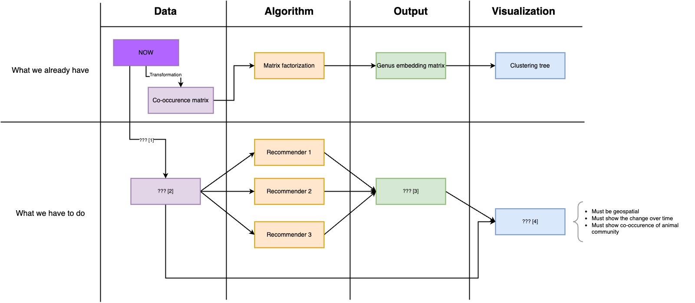

# FossilNOW

## Questions?

- How is this clustering done?
  - This was answered in the paper in Section 3.2 but still a little unclear
  - [HoangLe]: After using matrix factorization, we obtain 2 matrices **X** and **Y** which are embedded matrix of _site_ and _geneva_ respectively. Then we use hierachical clustering with **Y** to obtain the clustering tree.
- How was the validation of the model done?
- What are the numbers in the cluster plots
  - [HoangLe]: As in the caption of Figure 4, the numbers connected by the dash are the approximate age range in billion years. The numbers in the branket are a metric of the sites in which that genera lived.
- What are the x and y axes of the line charts?
- What are the column names of the file `res_all_Cervidae.csv` in the dir `4_outputs3`
  - [HoangLe]: According to the paper, **Cervidae** is a family name. By googling, I found that the left-most column contains the sites. So I think file `res_all_Cervidae.csv` contains the predicted occurence score of a family given the sites.
- The deadline is at the end of April. Inform the client!

## Sketch

Please visit [DSProject_FossilNOW](https://drive.google.com/file/d/1KbPRdbDTGs5pSB0M_LfZ21iL8WO6MxNj/view?usp=sharing) for the below sketch.

## Plan

- Two groups
  - one focusing on the recommender system
  - one focusing on the visualizations

## Visualization

Install packages:

`pip install -r requirements.txt`

Go to the source directory `src` and run locally:

`python app.py`
